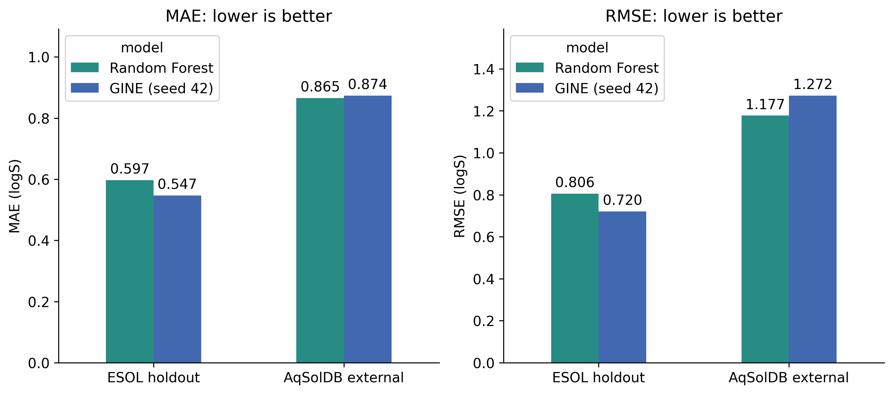
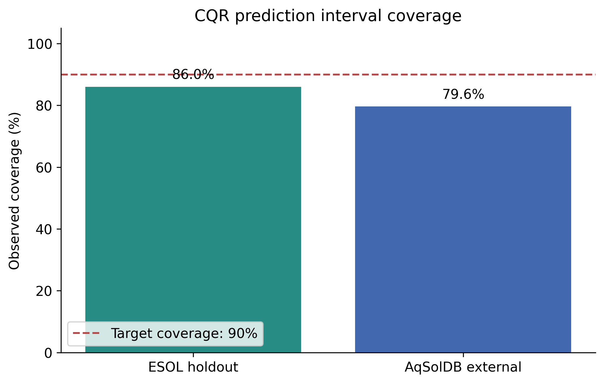

# 探索分子，了解水溶解度

制作者：chuanyanh

使用物质名称或 SMILES 查询分子，比较随机森林（RF）和图神经网络（GNN）的水溶解度估计，并展示独立 CQR 区间模型、结构相似性和描述符范围检查。

## 功能

- 6578 条 AqSolDB 名称—结构记录，另有 40 种常用物质的中文名称与别名。记录可能重复，不代表 6618 种独立物质，也不代表完整 AqSolDB。
- 手动 PubChem 在线查询：英文名称、CID，以及已收录中文别名。先确认来源与二维结构，再预测。查询取得分子结构，不是实测溶解度。
- 可旋转、缩放的三维分子，以及二维结构。
- 6 种物质的有来源外观示意：阿司匹林、乙醇、丙酮、甲醇、乙醚、乙腈。未收录外观资料的物质显示资料暂缺。示意图不是实物照片。
- JSON 结果下载，模型评价与研究方法说明。

## 运行（Python 3.12）

Linux / 云端：

```bash
python -m pip install -r requirements.txt
python -m streamlit run app.py
```

Intel Mac：

```bash
conda create -n solubility-web python=3.12 pip -y
conda activate solubility-web
python -m pip install -r requirements-mac-intel.txt
python -m streamlit run app.py
```

Intel Mac 使用 torch 2.2.2；Linux 依赖使用 torch 2.7.0。requirements-mac-intel-full.txt 保留用户原始环境记录，仅供参考；安装使用 requirements-mac-intel.txt。三维 JavaScript 资源已打包，不需要首次联网下载。PubChem 在线查询需要联网；内置库不需要联网。

保留 assets、data_library、data_pipeline、data_gnn 的相对位置。若端口被占用，先停止已有服务或用 `--server.port 8503`。终端运行服务时不会显示命令提示符；修改命令请在新终端中执行。

## 结果解释与限制

logS 为 mol/L 浓度的十进对数，换算为 mg/L 使用分子量。预测未指定温度、pH 或晶型，不能直接当成特定实验条件下的测量值，也不能据此判定固体/液体状态。

CQR（Conformalized Quantile Regression，共形化分位数回归）区间来自独立分位数模型，不是 RF/GNN 预测值的上下限。目标覆盖率为 90%；ESOL 留出集（186 条）实际覆盖率为 86.0%，AqSolDB 外部集（6578 条）为 79.6%。这些是数据集层面的评价，不代表当前分子有 90% 概率落在区间内。

外观资料独立于预测，来自 CDC/NIOSH 化学危害袖珍指南。源描述没有提供具体测定温度，页面仅展示常温常压情境，不模拟温度变化。

## 数据与第三方组件

- ESOL：Delaney (2004), ESOL: Estimating Aqueous Solubility Directly from Molecular Structure, DOI: 10.1021/ci034243x。
- AqSolDB：Sorkun et al. (2019), a curated database of aqueous solubility, DOI: 10.1038/s41597-019-0151-1。
- PubChem PUG REST：https://pubchem.ncbi.nlm.nih.gov/docs/pug-rest
- 3Dmol.js：https://3dmol.org/ ，BSD-3-Clause；许可和第三方声明见 assets。
- RDKit、PyTorch、PyTorch Geometric、scikit-learn、Streamlit、Plotly。

## 验证范围

用户已在 Intel Mac 上运行 RF/GNN/CQR、阿司匹林与法匹拉韦在线查询、三维结构和固体/液体外观。发布整理检查包括语法、文件完整性、40 种结构及分子式、搜索与错误处理、外观回退、3D HTML 生成。云端完整模型运行仍需部署后确认。

## English Overview

# Molecular Solubility Prediction

An interactive application for predicting aqueous molecular
solubility from SMILES using Random Forest and a GINE graph
neural network.

## Try the app

https://chuanyanh-solubility.streamlit.app/

## Features

- Single-molecule prediction and molecular visualization
- Batch prediction with downloadable CSV results
- Conversion between logS and mg/L
- Conformalized quantile regression prediction intervals
- Comparison with manually entered experimental measurements
- Chemical lookup and research results

## Evaluation

Models were trained on 920 ESOL molecules and evaluated on
a 186-molecule scaffold holdout.

The deployed GINE model achieved a holdout MAE of 0.547 logS
and an RMSE of 0.720 logS.

External evaluation used 6,578 filtered AqSolDB records.
Across three random seeds, GINE achieved a mean external
MAE of 0.855 logS.

The prediction interval had a target coverage of 90%.
Observed coverage was 86.0% on the ESOL holdout and 79.6%
on the external dataset.

## Limitations

Predictions do not explicitly account for temperature or pH.
Accuracy may decrease for molecules outside the training domain,
especially larger molecules.

Retrieved literature values are provided for exploratory
comparison. Their independence from the training and evaluation
data has not been fully verified.

## Model Comparison



The deployed GINE model (seed 42) achieved lower MAE and
RMSE than Random Forest on the ESOL scaffold holdout.
On the filtered AqSolDB external dataset, Random Forest
achieved lower errors than this GINE model.

## Prediction Interval Coverage



CQR targets 90% coverage. Observed coverage was 86.0%
on the ESOL holdout and 79.6% on the external dataset.
These results indicate reduced coverage under external
distribution shift.
